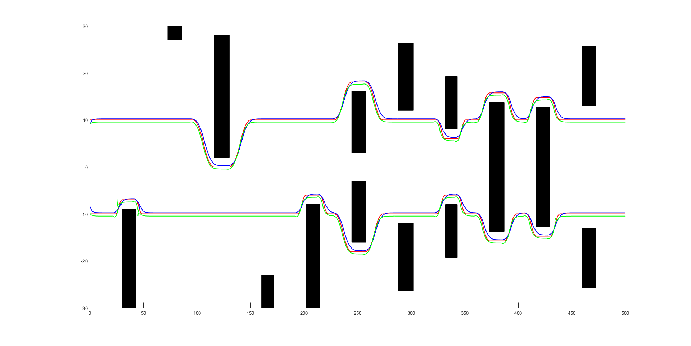

# 🤖 Formation Control with MPC

This MATLAB project implements **multi-agent formation control** using **Model Predictive Control (MPC)** in a 2D environment. A leader robot plans a trajectory while multiple follower robots maintain a formation using relative position constraints and obstacle avoidance.

> ✅ Developed independently by Caesar Zhao (MSc Robotics, UTS)

---

## 🚩 Project Overview

The simulation demonstrates a **leader-follower formation control strategy** with the following key components:

- **MPC-based planning**: Each robot predicts its motion and optimizes its trajectory under dynamic constraints.
- **Formation constraints**: Followers maintain relative distances to the leader or neighbors.
- **Obstacle avoidance**: The system supports randomly generated environments and ensures safe navigation.
- **Trajectory generation**: Realistic motion paths are computed with smooth transitions and collision-free behavior.

---

## 📁 File Structure

| File                      | Description                                      |
|---------------------------|--------------------------------------------------|
| `final.m`                | Main script to run the entire simulation         |
| `objectiveFunc_dis.m`    | Distance-based cost function for MPC             |
| `random_obs_choice.m`    | Logic to randomly select obstacles               |
| `random_obs_map.m`       | Map generation with randomly placed obstacles    |
| `traj_create.m`          | Trajectory creation logic for leader/followers   |
| `traj_obs_pass.m`        | Obstacle passing trajectory correction           |
| `traj_obs_pos_act.m`     | Active obstacle position adaptation              |
| `final_1.png`            | Screenshot of final simulation result            |
| `*.mp4` / `*.jpg`        | Optional visualizations or recordings            |

---

## 📸 Simulation Result

<div align="center">
  
  <br/>
  <em>Leader-follower formation with dynamic obstacle avoidance</em>
</div>

---

## ▶️ How to Run

1. Open MATLAB.
2. Make sure all `.m` files are in the same working directory.
3. In the Command Window:

```matlab
run final
```

> The script will generate a leader path and compute optimal follower positions over time using MPC.

---

## 🧠 Key Concepts

- **Model Predictive Control (MPC)**:
  Predicts future robot states and optimizes control inputs while respecting dynamics and constraints.

- **Formation Control**:
  Followers maintain fixed relative displacements (e.g., V-shape, line) using local MPC modules.

- **Obstacle Avoidance**:
  Uses repulsive cost terms and trajectory reshaping in `traj_obs_pass.m`.

---

## 📜 License

This project is for academic demonstration purposes only.  
© 2024 Caesar Zhao. All rights reserved.

---

## 📬 Contact

**Zhiye (Caesar) Zhao**  
📧 zhiye.zhao-1@student.uts.edu.au  
🌐 [Portfolio Website](https://caesar1457.github.io/zhiyezhao/)
